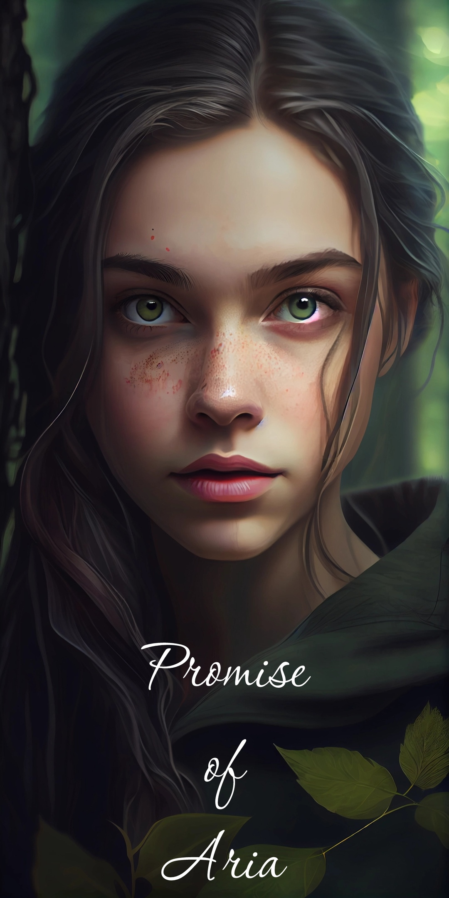
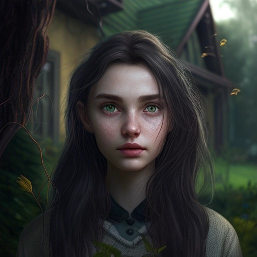
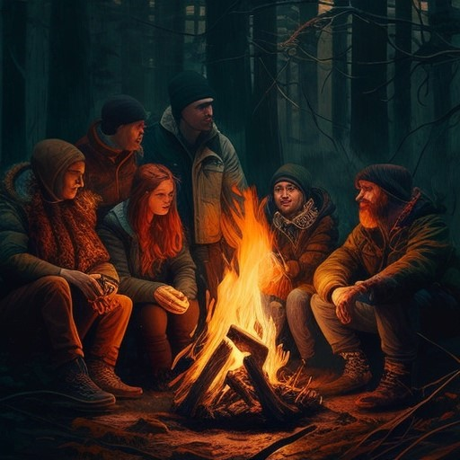
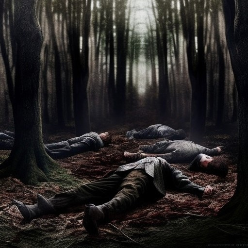
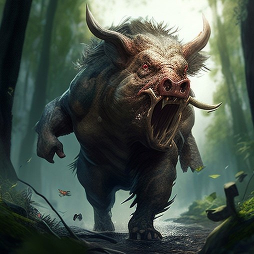
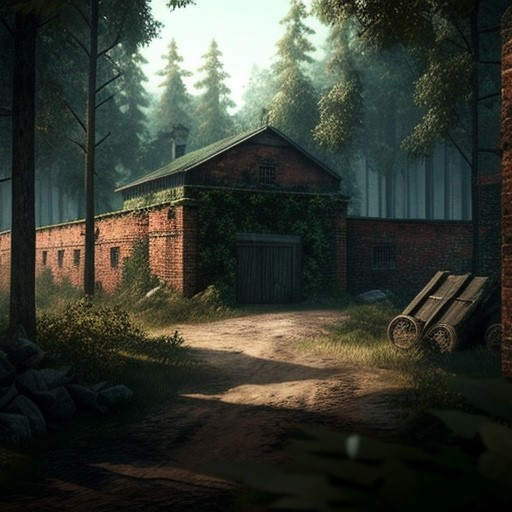
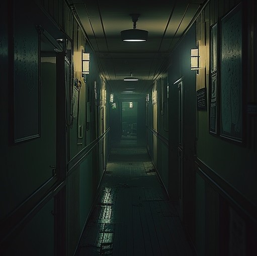
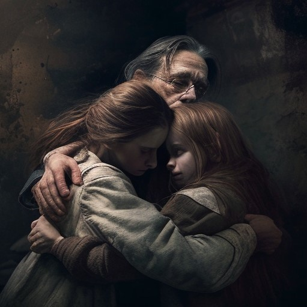

# Обещание Арии

## Глава 1

Ария слышала истории о рейдерах, нападавших на соседние деревни, но она никогда не думала,
что это случится с её собственной. Она подметала крыльцо своей семейной хижины, когда 
услышала звук двигателей вдалеке. Сначала она подумала, что это просто проезжающий караван, 
но шум становился всё громче и зловещее.

Ария побежала к краю деревни, где увидела приближающуюся группу машин. Когда они подошли 
ближе, она увидела, что они были бронированы и вооружены установленными орудиями. Её сердце 
забилось в груди, когда она осознала правду: это были рейдеры, и они собирались напасть на 
её деревню.

Ария побежала обратно в свою хижину, по пути схватив свою младшую сестру Киру. Вместе они 
втроём забаррикадировались внутри и скорчились в страхе, когда рейдеры обрушились на 
деревню.

Нападавшие были беспощадны, стреляли из своего оружия и поджигали здания. Ария могла 
слышать крики своих соседей и друзей, когда их убивали на улицах. Она молилась, чтобы её 
отец, который в то время был на охоте, был в безопасности.

Семья Арии забилась в свою хижину, прислушиваясь к хаосу, разворачивающемуся снаружи. Дым 
просачивался сквозь стены, и они кашляли и задыхались, когда огонь приближался. Ария могла 
чувствовать тепло пламени, когда оно лизало соломенную крышу.

«Мы должны выбраться отсюда», сказала Кира дрожащим голосом. «Мы не можем оставаться здесь 
и ждать, пока нас найдут».

Ария кивнула, зная, что её сестра права. Им нужно было бежать, пока не стало слишком 
поздно. Она схватила рюкзак, который лежал у двери, в котором было несколько припасов и 
кое-какое оружие, которому научил её пользоваться отец.

Они прошли через заднюю дверь хижины, которая вела к небольшому лесу за деревней. Они могли 
слышать, как налетчики кричали и смеялись, обыскивая оставшиеся дома.

Ария провела сестру через деревья, стараясь оставаться тихой и незаметной. Они не знали, 
куда идут, но знали, что должны уйти как можно дальше от рейдеров. Они шли часами, у них 
болели ноги и пересохло в горле, пока, наконец, они не рухнули от истощения.

Когда они лежали на земле, переводя дыхание, Ария поняла, что все, что она когда-либо 
знала, исчезло. Её дом, её друзья и её образ жизни были разрушены в считанные минуты. И 
теперь она и её сестра остались одни в опасном постапокалиптическом мире. Единственное, что 
им оставалось делать, это выживать.

## Глава 2

Разум Арии представлял собой беспорядочный беспорядок мыслей и воспоминаний, когда она 
лежала на земле, пытаясь отдышаться. Она не могла поверить в то, что только что произошло с 
её деревней, и не могла избавиться от ощущения, что всё это как-то связано с апокалипсисом.

Глядя в небо, она не могла не вспомнить, как её родители неустанно работали, чтобы 
подготовиться к худшему. Они запаслись едой и водой, построили убежище и научили её и Киру, 
как выжить в мире, который, казалось, разваливается.

Но даже при всей их подготовке они не могли предсказать весь масштаб апокалипсиса. 
Правительства и власти рухнули, воцарился хаос. Улицы были наполнены насилием и 
беззаконием, и люди в отчаянии набрасывались друг на друга, в этом хаосе погибла и мать 
Арии.

Отец Арии сделал все возможное, чтобы защитить дочерей от опасности, но все же столкнулся с 
многочисленными проблемами. Им приходилось собирать пищу и воду, отбиваться от рейдеров и 
банд и скрываться от мутировавших существ, бродивших по земле.

Это была суровая и неумолимая жизнь, но Ария выросла в ней. Она научилась быть жесткой, 
находчивой и выносливой. Она видела, как её отец приносил жертвы, боролся, чтобы защитить 
её и сестру, и цеплялся за надежду, что они смогут выжить.

И теперь, когда она лежала на земле вместе с Кирой, она знала, что должна снова стать 
сильной. Она должна была найти способ сохранить жизнь себе и своим близким в мире, который 
стал ещё более опасным, чем прежде.

Ария села и огляделась, осматриваясь вокруг. Они находились в лесистой местности, без 
каких-либо признаков жизни, кроме деревьев и случайного шороха диких животных. Она знала, 
что они не могут оставаться там вечно, и что им срочно нужно найти новый дом.

Но сначала им нужно было отдохнуть и восстановить силы. Ария вытащила из своего рюкзака 
некоторые припасы — несколько банок с едой, немного воды и аптечку — и начала лечить раны 
Киры.

Пока она работала, она чувствовала, как тяжесть их положения давит на неё. Апокалипсис 
забрал у неё всё, и ей приходилось бороться за выживание каждый день. Но она отказалась 
сдаваться. У неё была сестра, её навыки и её решимость, и она знала, что с этими вещами она 
может противостоять всему, что бросает ей новый мир.

## Глава 3

Сердце Киры бешено колотилось, когда она лежала на земле, её грудь вздымалась с каждым 
прерывистым вдохом. Она не могла избавиться от чувства паники, охватившего её, когда 
рейдеры напали на их деревню. Как будто вся травма и страх перед апокалипсисом настигли её 
в тот момент, и она не могла это контролировать.

Ария сидела рядом со своей сестрой, её рука успокаивающе водила кругами по спине Киры. — 
«Просто дыши, Кира» — тихо сказала она. «Теперь ты в безопасности».

Но Кира не могла остановить слезы, катившиеся по её лицу, и то, как её тело сотрясалось от 
рыданий. «Я больше не могу этого делать, Ария», — выдохнула она. «Я не могу продолжать так 
жить. Это слишком».

Сердце Арии болело за сестру, но она знала, что они не могут позволить себе сдаться. Они 
должны были продолжать двигаться вперед, даже когда это казалось невозможным. — «Мы 
справимся с этим вместе, Кира» — твердо сказала она.

Некоторое время они сидели молча, слышался только шелест листьев и далекий щебет птиц. 
Разум Арии пронёсся с мыслями об их следующем шаге. Они не могли оставаться на одном месте 
долго — это было слишком опасно. Им нужно было найти новое место, которое они могли бы 
назвать домом, место, где они могли бы быть в безопасности.

Но их планы были прерваны, когда они услышали приближающиеся шаги. Ария тут же напряглась, 
потянувшись за ножом на поясе. Она жестом попросила Киру молчать, и они ждали, стуча сердца 
в ушах.

Это был рейдер. Ария узнала его лицо по нападению на деревню. Он был один, вооруженный 
самодельным клинком, и в его глазах читался голод, от которого кровь Арии стыла в жилах.

«Дайте мне свои припасы», — сказал рейдер грубым и угрожающим голосом. — «И, может быть, я 
позволю вам жить».

Ария знала, что доверять ему нельзя. Он был из тех людей, которые сделают все, чтобы 
выжить, даже если это будет означать причинение вреда другим. Она крепче сжала нож и 
шагнула вперед. Рейдер рванулся на неё своим клинком, и Ария ловко отступила от него, 
полоснув его руку своим ножом.

Он взвыл от боли, но не сдался. Он снова бросился на неё, и Ария снова увернулась от него, 
порезав ему другую руку. Рейдер споткнулся, и Ария увидела, как он открылся. Она вонзила 
нож ему в грудь, и он упал на землю замертво.

Ария постояла там какое-то время, её сердце колотилось в груди. Она никогда раньше никого 
не убивала, и тяжесть этого легла на её плечи. Но она знала, что сделала то, что должна 
была сделать, чтобы защитить свою сестру.

Кира посмотрела на неё широко раскрытыми глазами, но Ария увидела в них восхищение и 
благодарность. Адреналин всё ещё струился по их венам. «Мы должны продолжать двигаться», — 
сказала Ария. «Мы не можем оставаться здесь. Пошли».

Они собрали свои припасы и отправились на поиски отца. Ария понимала, что их путешествие 
будет наполнено опасностями, но возвращаться им было некуда.

## Глава 4

Ария и Кира брели через густой подлесок, под их ногами хрустели сухие листья и ломались 
ветки. Адреналин от предыдущей встречи исчез, оставив Арию с затянувшимся чувством 
беспокойства.

Она не могла избавиться от ощущения, что за ними следят. Каждый раз, когда они 
останавливались, чтобы отдохнуть, она осматривала окрестности в поисках любых признаков 
опасности.

Но в лесу было жутко тихо, ни птичьего пения, ни шелеста листьев. Словно сам воздух затаил 
дыхание, ожидая, что что-то произойдет.

Мысли Арии вернулись к историям, которые отец рассказывал о дне, когда начался апокалипсис. 
Они были в городе и едва выбрались оттуда живыми. Ария родилась много лет спустя, в мире, 
который сильно отличался от того, который знали её родители.

Но даже тогда она знала, что её выживание зависит от её способности адаптироваться. Она 
выросла в мире, где опасность таилась за каждым углом, где каждое решение могло означать 
разницу между жизнью и смертью.

Пока они шли, их внимание привлек шум бегущей воды. Ария и Кира направились к источнику, и 
вскоре они вышли из-за деревьев и увидели мчащуюся реку.

Ария почувствовала проблеск надежды. Она окунула фляжку в воду и сделала большой глоток, 
чувствуя, как прохладная жидкость успокаивает её пересохшее горло.

Пока они пополняли свои запасы, они услышали голоса вдалеке. Ария и Кира обменялись 
взглядами, а затем поползли на звук. Подойдя поближе, они увидели группу людей, 
сгрудившихся вокруг костра, с мрачными и решительными лицами.

Сердце Арии подпрыгнуло. Это могло быть их шансом найти помощь, может быть, даже найти 
своего отца.

Они с Кирой медленно подошли к группе, подняв руки в жесте мира. Люди повернулись к ним с 
настороженными лицами.

«Мы ищем нашего отца», сказала Ария ровным голосом. «На нашу деревню сегодня напали 
рейдеры, пока отец был на охоте».

Группа обменялась взглядами, затем один из них шагнул вперед. Это был высокий мускулистый 
мужчина со шрамом на щеке.

«Мы — отряд сопротивления», — сказал он. «Мы боремся с рейдерами, пытаемся защитить людей. 
Мы можем помочь тебе найти твоего отца, но это будет нелегко. Рейдеры — мощная сила, и 
сейчас очень опасно приближаться к вашей деревне».

Ария кивнула, её сердце сжималось от тяжести их положения. Но она знала, что они не могут 
сдаться. Они с Кирой зашли слишком далеко, чтобы упустить отца.

— «Мы сделаем всё, что потребуется» — сказала она, встретившись взглядом с мужчиной. — 
«Просто скажи нам, что нам нужно сделать».

Мужчина кивнул, в его глазах мелькнуло уважение — «Ваш отец мог попасть в плен к рейдерам, 
возможно вам придётся сражаться с ними».

Ария посмотрела на свои руки, чувствуя мерцание сомнения. Могли ли они действительно 
сделать это? Смогут ли они выйти живыми из схватки с рейдерами?

«Безопаснее всего будет отправиться на поиски утром» — сказал мужчина, — «Рейдеры наименее 
активны в это время. Сейчас стоит отдохнуть, а с утра мы соберёмся на поиск».

Ария посмотрела на Киру. На лице девочки явно читалась истощённость, поэтому Ария приняла 
взвешенное решение согласиться на предложение мужчины.

«Можете звать меня Маркус» — сказал мужчина и протянул руку девушке. Произошло рукопожатие.

Ария лежала на земле, глядя в небо. Звёзды мерцали над головой, их свет заливал лес мягким 
светом. Шум проносящейся реки заполнил её уши, убаюкивая чувством умиротворения.

Но даже в тишине ночи её разум кипел. Она думала обо всем, что произошло, от нападения на 
их деревню до встречи с отрядом сопротивления.

Мысли её обратились к отцу, и глубокая боль в груди усилилась. Она так скучала по нему, 
скучала по звуку его голоса.

Засыпая, она дала себе молчаливое обещание. Она найдёт своего отца, чего бы это ни стоило.

## Глава 5

Утреннее солнце выглянуло из-за деревьев, когда Ария, Кира и отряд сопротивления 
отправились на поиски рейдеров. Они часами шли через густой лес по тропе, разведанной 
отрядом ранее.

Когда они подошли к лагерю рейдеров, сердце Арии забилось от предвкушения. Но подойдя 
поближе, они увидели то, от чего у них похолодела кровь.

На поляне валялись трупы жертв жестокого нападения. Арии стало плохо, когда она увидела 
искривленные конечности и разорванную плоть, свидетельство жестокой битвы.

Внезапно их внимание привлек стон. Они обернулись и увидели одинокого рейдера, лежащего на 
земле в полубессознательном состоянии. Отряд осторожно приблизился, оружие наизготовку.

«Что здесь случилось?» — спросил Маркус, командир отделения.

Глаза рейдера распахнулись, и он посмотрел на них с затравленным выражением лица. — 
«Животное-мутант», — пробормотал он. «Появился из ниоткуда. У нас не было шансов».

Сердце Арии упало, когда она услышала слова рейдера. Они прошли весь этот путь зря. Но 
затем рейдер снова заговорил, его голос был слабым, но настойчивым.

«Один из наших пленников… он сбежал. Он может что-то знать о мутанте. Пожалуйста… найдите 
его».

Отряд быстро обыскал местность и, конечно же, нашел следы, ведущие в сторону от места 
происшествия. Они последовали за ними вглубь леса, высматривая хоть какой-нибудь признак 
пленника.

Когда солнце начало садиться, они наконец нашли его — молодого человека, едва достигшего 
подросткового возраста. Его звали Джейк, он был ранен, но жив, и рассказал им все, что знал.

По его словам, мутант, напавший на рейдеров, не был похож ни на что из того, что он 
когда-либо видел раньше. Он был массивным, с острыми как бритва когтями и зубами, похожими 
на ножи. Он обрушился на рейдеров без предупреждения, разорвав их на части в кровавом 
безумии.

Но самое главное, что рассказал им подросток, это то, что рейдеры недавно захватили группу 
выживших, в том числе человека, который соответствовал описанию отца Арии.

Сердце Арии колотилось, когда она его слушала. Они приближались к истине, Ария чувствовала, 
что момент их с Кирой воссоединения с отцом всё ближе и ближе.

## Глава 6

Пока они шли через лес, Джейк поплелся за отрядом. Ария следила за ним, чтобы он не упал от 
истощения.

Несмотря на свои травмы, Джейк был полон решимости помочь спасти пленников из лагеря 
рейдеров. Он хорошо знал местность и имел опыт во встречах с рейдерами.

Ария была благодарна Джейку за помощь. Она чувствовала, как тяжесть её ответственности 
растет с каждым шагом. Теперь дело было не только в том, чтобы найти её отца — им нужно 
было спасти и других выживших.

Когда они прибыли на территорию, они увидели истерзанные тела рейдеров вокруг лагеря. Было 
очевидно, что мутант уже добрался сюда.

Джейк привел их к скрытому входу, и они проскользнули внутрь лагеря.

По мере того, как они продвигались вглубь комплекса, звуки мутанта становились всё громче. 
Ария чувствовала, как её сердце колотится от страха и предвкушения.

Наконец они вышли в длинный коридор, в конце которого была дверь, за которой слышались 
голоса выживших пленных. Среди них Ария услышала своего отца. Она хотела было броситься к 
двери, но её прервал дикий рёв мутанта сзади.

Отряд обернулся. Мутант был там, рыча и огрызаясь, приближаясь к ним.

Отряд держал оружие наизготовку. Руки Арии дрожали от страха, но она знала, что должна 
оставаться сосредоточенной. Вот он, момент, к которому они все готовились.

Мутант бросился на них, его массивные когти блеснули в тусклом свете. Ария ринулась к нему 
навстречу, но её остановил Маркус. «Бери сестру и прячьтесь с выжившими» — сказал он. Ария 
посмотрела на Киру. Её лицо было в слезах, а рот сжался в истерике. Ария приняла взвешенное 
решение послушаться командира, чтобы спасти жизнь сестры. Она схватила Киру за руку и 
побежала к двери.

Ария добежала к двери как раз в тот момент, когда отряд схлестнулся с мутантом в битве. Она 
дрожащими руками подняла дверной замок и пропустила сестру в комнату. Внутри было шестеро 
пленных, и самое главное — там был отец — человек, ради которого Ария и Кира проделали весь 
этот путь.

## Глава 7

"Папа!" — воскликнула Ария, бросаясь в его объятия.

Он крепко держал дочерей, со слезами на глазах — «Я думал, что больше никогда вас не увижу».

Они долго обнимали друг друга, и Ария почувствовала, как её наполняет чувство 
умиротворения. На лице Киры были слёзы, но теперь это были слёзы счастья. Они нашли друг 
друга.

Когда они вышли из лагеря рейдеров, Ария почувствовала облегчение. Они пережили мутанта и 
спасли жизни пленников. Но их победа досталась дорого. Маркус был ранен в бою, и им 
пришлось вынести его из лагеря.

По пути в лагерь отряда Ария и её отец часами разговаривали, выясняя, что произошло за 
время их разлуки. С наступлением ночи Ария направилась к палатке медика, чтобы проверить 
Маркуса. Он был тяжело ранен, но выкарабкался. Она часами сидела рядом с ним, думая обо 
всём, что произошло.

В конце концов, она знала, что им предстоит долгий путь. Но они справились бы вместе, как 
семья. И с помощью отряда сопротивления они будут работать над восстановлением своего 
разрушенного мира.

Когда она заснула, Ария почувствовала, как её наполняет надежда. Будущее было не 
определено, но они были живы и были друг у друга, и это было самое главное.
