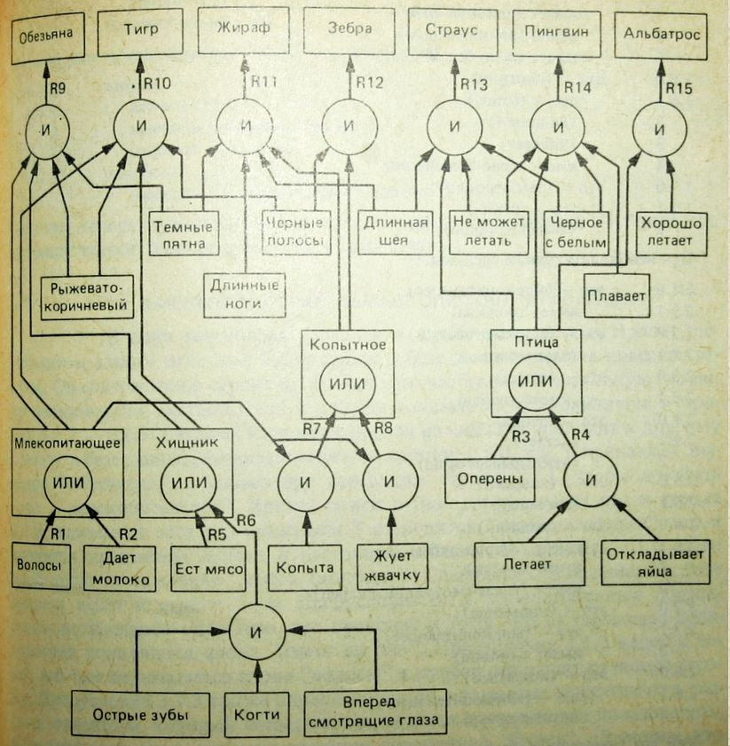

# Отчет по лабораторной работе #2
## по курсу "Искусственый интеллект"

### Студенты: 

| ФИО                         | Роль в проекте                                                                        | Оценка       |
|-----------------------------|---------------------------------------------------------------------------------------|--------------|
| Борисов Ян (М8О-308Б-20)    | Расширил схему предметной области, переносил схему предметной области                 |              |
| Зубко Дмитрий (М8О-308Б-20) | Реализовал интерфейс программы, составил отчёт                                        |              |
| Попов Матвей (М8О-308Б-20)  | Составил схему предметной области, переносил схему предметной области, составил отчёт |              |


> *Комментарии проверяющих (обратите внимание, что более подробные комментарии возможны непосредственно в репозитории по тексту программы)*

## Тема работы

Нашей предметной областью является выбор ресторана для того чтобы отметить какой-либо 
праздник, пригласить девушку (или парня) на свидание или просто пообедать после работы 
в зависимости от бюджета и вкусовых предпочтений.

## Концептуализация предметной области

<!-- Опишите результаты концептуализации предметной области:
 - выделенные понятия
 - связи между ними, тип получившейся онтологии (словарь, сеть, иерархия и т.д.)
 - опишите возможные статические и динамические знания
 - как предметная область может быть разделена между участниками для коллективного создания базы знаний 

Приведите графические иллюстрации:
 -->

Сначала на основании таких фактов, как бюджет, количество людей и событие, определяется 
класс ресторана. Это может быть крутой ресторан, средний ресторан или обычная забегаловка.
Потом на основании вкусовых предпочтений и местоположения пользователя выбираем конкретный ресторан.
Такую систему можно очень легко расширить, можно ввести новые районы или виды кухонь или 
существенно расширить базу ресторанов. 

### Схема предметной области


## Принцип реализации системы

<!-- Опишите:
 - Какой механизм вывода вы предполагаете использовать и почему
 - Какую систему программирования вы предполагаете использовать и почему
 - Если это имеет смысл, приведите графическую иллюстрацию архитектуры системы. Если система состоит из разных частей (бот, механизм вывода) - опишите принципы интеграции -->

Разрабатывать программу было решено средствами модуля PyKnow для Python, потому 
что это всем знакомый язык, а использование модуля интуитивно понятно.


## Механизм вывода

<!-- Опишите, как работает механизм вывода. Наиболее интересные фрагменты кода приведите в отчете. -->

На базе библиотеки PyKnow был реализован прямой вывод. Сначала определяем класс ресторана:


Затем определяем ресторан в зависимости от выбранной кухни и района.

## Извлечение знаний и база знаний

<!-- Опишите, как происходило извлечение знаний, с учётом совместной работы над проектом. Приведите фрагменты представления знаний: дерево И-ИЛИ, наиболее интересные правила.  -->

В составлении базы ресторанов очень помогли Google карты, с помощью которых можно легко 
отобрать рестораны по району, кухне и ценовой доступности. Также с классификацией 
некоторых ресторанов помог личный опыт нашей команды. Для того, чтобы определить 
класс ресторана, потребовалось немного логики и здравого смысла (свидание в столовой — не самая лучшая идея). 

## Протокол работы системы

<!-- Приведите несколько примеров работы системы, проиллюстрируйте их фрагментами деревьев вывода. -->
```
    PS C:\Users\papey08\github-classroom\MAILabs-Edu-2023\ai-lab-2-ai-lab-2-popov-zubko-borisov> & C:/Miniconda3/python.exe c:/Users/papey08/github-classroom/MAILabs-Edu-2023/ai-lab-2-ai-lab-2-popov-zubko-borisov/main.py
    Когда?
    1. После работы  2. Праздник  3. Свидание
    1
    Сколько людей?
    1. один  2. два-три  3. Много
    2
    Бюджет?
    1. мало  2. средний  3. много
    1
    Кухня?
    1. французская    2. русская    3. грузинская    4.итальянская    5.американская
    2
    Район?
    1. Вся Москва  2. САО  3. ЦАО  4. ЮЗАО
    2
    Банкет в Ледокол
```

```
    PS C:\Users\papey08\github-classroom\MAILabs-Edu-2023\ai-lab-2-ai-lab-2-popov-zubko-borisov> & C:/Miniconda3/python.exe c:/Users/papey08/github-classroom/MAILabs-Edu-2023/ai-lab-2-ai-lab-2-popov-zubko-borisov/main.py
    Когда?
    1. После работы  2. Праздник  3. Свидание
    3
    Сколько людей?
    1. один  2. два-три  3. Много
    2
    Бюджет?
    1. мало  2. средний  3. много
    3
    Кухня?
    1. французская    2. русская    3. грузинская    4.итальянская    5.американская
    1
    Район?
    1. Вся Москва  2. САО  3. ЦАО  4. ЮЗАО
    3
    Банкет в Клод Монэ
```

```
    PS C:\Users\papey08\github-classroom\MAILabs-Edu-2023\ai-lab-2-ai-lab-2-popov-zubko-borisov> & C:/Miniconda3/python.exe c:/Users/papey08/github-classroom/MAILabs-Edu-2023/ai-lab-2-ai-lab-2-popov-zubko-borisov/main.py
    Когда?
    1. После работы  2. Праздник  3. Свидание
    1
    Сколько людей?
    1. один  2. два-три  3. Много
    1
    Бюджет?
    1. мало  2. средний  3. много
    1
    Кухня?
    1. французская    2. русская    3. грузинская    4.итальянская    5.американская   6. японская
    6
    Район?
    1. Вся Москва  2. САО  3. ЦАО  4. ЮЗАО
    2
    Банкет в Марукамэ
```

## Выводы

Проделав лабораторную работу, мы разработали экспертную систему для выбора ресторана 
в зависимости от потребностей пользователя. Она довольно неплохо подбирает класс ресторана 
на основе предстоящего события и бюджета, но есть и недостаток, заключающийся в маленькой 
базе конкретных ресторанов, из-за чего не составит сложности подобрать такую комбинацию 
ответов на вопросы, на которую программа не сможет подобрать ресторан. 

<!-- Сформулируйте *содержательные* выводы по лабораторной работе. Чему он вас научила? 
Над чем заставила задуматься? В чём состояли основные сложности в работе? Насколько эффективной получилась командная работа, и какие методы для повышения эффективности командной работы вы использовали (scrum, slack, ...)?

Помните, что несодержательные выводы -
самая частая причина снижения оценки. -->
