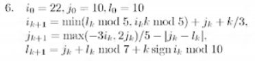
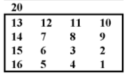

# Вычислительные системы

Отчёты к лабораторным работам лучше не смотреть, там ничего нет.

## Лабораторная работа №1-2

Разрабокта bash-скрипта, включающего следующие команды: cd, cp, mv, ls, cat, xargs, find, mkdir, rm, pwd, echo, pushd/popd. Также bash-скрипт должен содержать примеры работы с конвейерами и стандартными потоками ввода-вывода.

## Лабораторная работа №3

Проводилась в формате самостоятельной работы, поэтому задания не сохранились.

## Лабораторная работа №5 (Вариант 26)

Проверить палиндромию двоичного числа.

Для запуска программы скачать [это](http://faq8.ru/file.php/2/517/jstu4-2.3.rar).

## Лабораторная работа №6 (Вариант 11)

Перевод числа из шестнадцатеричной системы счисления в четверичную (логарифмическая сложность).

Для запуска программы скачать [это](http://faq8.ru/file.php/2/666/TuringDiagrams.zip).

## Лабораторная работа №7 (Вариант 25, 26)

Составить алгоритм увеличения на единицу целого неотрицательного числа в шестнадцатеричной позиционной системе счисления.

Составить алгоритм уменьшения на единицу целого неотрицательного числа в шестнадцатеричной позиционной системе счисления.

Для запуска программ скачать [это](http://yad-studio.github.io).

## Лабораторная работа №9 (Вариант 6)

## Лабораторная работа №11 (Вариант 7)

Закодировать текст по Цезарю с переменным ключом, равным номеру буквы в слове +3.

## Лабораторная работа №12 (Вариант 4)

Выбрать цифры, равные сумме двух предыдущих.

## Лабораторная работа №13 (Вариант 21)

Есть ли слово, содержащее ровно одну гласную?

## Лабораторная работа №14 (Вариант 20)

## Лабораторная работа №15 (Вариант 20)

Замена всех минимальных элементов матрицы на сумму элементов соответствующего столбца.

## Курсовой проект

Подробные описания заданий есть в отчётах.
