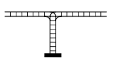

# Отчет по лабораторной работе №3

## по курсу "Логическое программирование"

## Решение задач методом поиска в пространстве состояний

### студент: Попов Матвей, группа М8О-208Б-20

## Результат проверки

| Преподаватель     | Дата         |  Оценка       |
|-------------------|--------------|---------------|
| Сошников Д.В. |              |               |
| Левинская М.А.|              |               |

> *Комментарии проверяющих

## Введение

Метод поиска в пространстве является мощным инструментом для решения задач искусственного интеллекта, а именно для решения таких задач, в которых присутствуют различные переходы и состояния.  
Prolog крайне удобен для решения таких задач методом поиска в пространстве, так как он даёт возможность задавать состояния в виде предикатов.

## Задание

Вариант 3. Железнодорожный сортировочный узел устроен так, как показано на рисунке. На левой стороне собрано некоторое число вагонов двух типов (черные и белые), обоих типов по n штук., в произвольном порядке. Тупик вмещает все 2n вагонов. Пользуясь тремя сортировочными операциями (слева в тупик, из тупика направо, слева направо, минуя тупик), собрать вагоны на левой стороне, так, чтобы типы чередовались. Для решения задачи достаточно 3n-1 сортировочных операций.  



## Принцип решения

Пользователь вводит предикат с нужным ему алгоритмом поиска и последовательность вагонов в виде списка.  
Используемые предикаты:  

* Поиск в ширину:  

```(Prolog)
wsearch(S, R) :-
   sol(S, G),
   wsearch1([[[S, [], []]]], [[], [], G], R1),
   !,
   reverse(R1, R2),
   more(R2, R).
```

Предикат extra используется для вывода пошагового решения, wsearch1 используется для продолжения поиска.

* Поиск в глубину:  

```(Prolog)
dsearch(X, R) :-
    sol(X, G),
    dsearch1([[X, [], []]], [[], [], G], R1),
    reverse(R1, R).
```

Предикат sol датё конечное состояние, dsearch1 продлевает поиск, в результате получаем список состояний.

* Поиск в глубину с итеративным погружением:

```(Prolog)
disearch(X, R) :- 
    sol(X, G),
    dig(CC),
    disearch1([[X, [], []]], [[], [], G], R1, CC), !,
    reverse(R1, R2), 
    more(R2, R).
```

Предикат dig необходим для ограничения глубины поиска предикатом disearch1.

## Результаты

Приведите результаты работы программы: найденные пути, время, затраченное на поиск тем или иным алгоритмом, длину найденного первым пути. Используйте таблицы,
если необходимо.

| Алгоритм поиска |  Длина найденного первым пути  |  Тест  |
|-----------------|--------------------------------|----------------|
| В глубину       |               6                 |     w, w, b, b           |
| В ширину        |                   6             |    w, w, b, b            |
| В глубину с итеративным погружением              |           6                     |       w, w, b, b         |

## Тестирование

```(Prolog)
2 ?- wsearch([w, w, b, b], R).
R = [[w, w, b, b], [], []] ;
R = [[w, b, b], [], [w]] ;
R = [[b, b], [w], [w]] ;
R = [[b], [w], [b, w]] ;
R = [[b], [], [w, b, w]] ;
R = [[], [], [b, w, b, w]] ;
false.
```

## Выводы

проделав лабораторную работу, я написал программу решения задачи искуственного интеллекта с помощью поиска в пространстве состояний, благодаря чему смог найти ввсе решения для поставленной задачи различными алгоритмами, а также обнаружил различия в работе разных алгоритмов поиска и их преимущества и недостатки.
