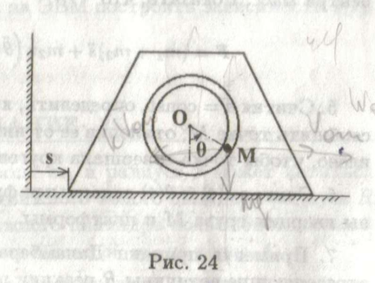
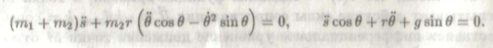

# Теоретическая механика и основы компьютерного моделирования

## Лабораторная работа №1 (Вариант 18)

Анимировать движение точки, заданное уравнениями в полярных координатах:

𝒓(𝒕) = 𝟏 + 𝟏. 𝟓 𝒔𝒊𝒏 𝟏𝟐𝒕 , 𝛟(𝒕) = 𝟏. 𝟐𝒕 + 𝟎. 𝟐 𝒄𝒐𝒔 𝟏𝟐𝒕

## Лабораторная работа №2 (Вариант 24)

Анимировать систему, изображённую на рисунке:

## Лабораторная работа №3-4 (Вариант 24)

Анимировать систему из лабраторной работы №2, согласно уравнению движения:

